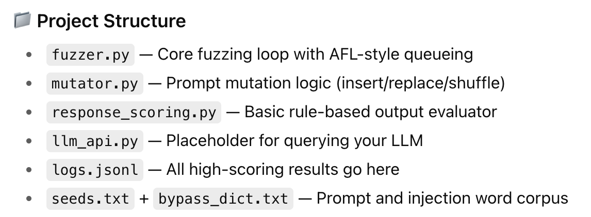

# Directory structure for Prompt Injection Fuzzer (AFL-style)

# 📁 project_root/
# ├── fuzzer.py                   # Main fuzzing loop (entry point)
# ├── prompts/
# │   ├── seeds.txt              # Initial seed prompts
# │   └── bypass_dict.txt        # Dictionary of known bypass terms/phrases
# ├── mutations/
# │   └── mutator.py             # AFL-style mutation functions
# ├── evaluation/
# │   ├── response_scoring.py    # Evaluator: rate LLM response
# │   └── prompt_filter.py       # Optionally detect successful injection
# ├── outputs/
# │   └── logs.jsonl             # JSONL log of successful prompt injections
# └── utils/
#     └── llm_api.py             # Interface to query the LLM

